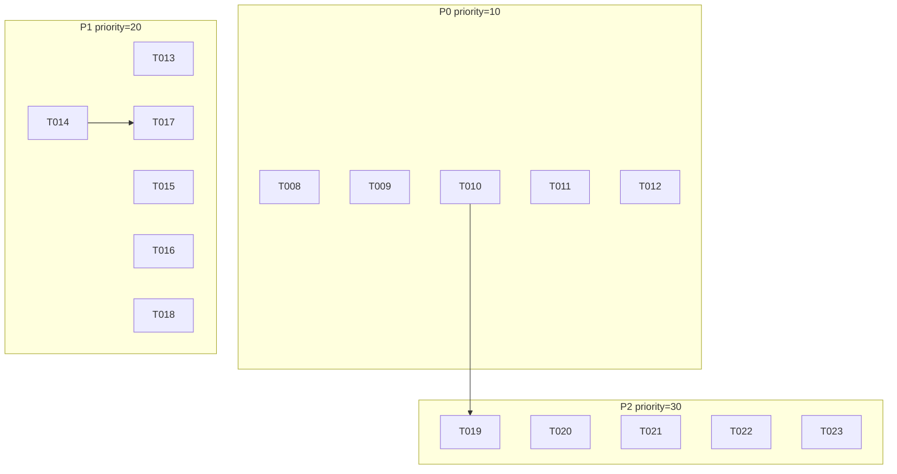

# feature-detail.md — 审查修复迭代 1

> 迭代: iter-003-审查修复-迭代1
> 来源: 审查报告 doc-sparkling-torvalds.md (19 issues)
> 状态: 已规划 16 个任务 (T008-T023)

---

## P0 — 严重问题 (priority=10)

### T008: 同步 marketplace.json 版本号为 1.4.0

| 字段 | 内容 |
|------|------|
| 关联问题 | P0-1: marketplace.json vs plugin.json 版本不一致 (1.2.0 vs 1.4.0) |
| 涉及文件 | `.claude-plugin/marketplace.json` |
| 验收标准 | `plugin.json` 和 `marketplace.json` 的版本字段均为 `1.4.0` |
| 测试命令 | `python -c "import json; a=json.load(open('.claude-plugin/plugin.json')); b=json.load(open('.claude-plugin/marketplace.json')); assert a['version']==b['plugins'][0]['version'], 'version mismatch'; print('version OK:', a['version'])"` |

---

### T009: 更新 architecture.md 语言分布表与 PS1 引用

| 字段 | 内容 |
|------|------|
| 关联问题 | P0-2 + P0-3 (architecture.md 部分) |
| 涉及文件 | `docs/architecture.md` (~10 处修改) |
| 验收标准 | 语言分布表删除 PowerShell 占比，显示 Python 为主；所有 .ps1 引用改为 .py；运行时要求表删除 PowerShell 5.1+ |
| 测试命令 | `grep -c "PowerShell" docs/architecture.md` (应≤0，历史示例除外；之后手动检查上下文) |

---

### T010: 清理其余文档中的 .ps1 残留引用

| 字段 | 内容 |
|------|------|
| 关联问题 | P0-3 (architecture.md 之外的文档) |
| 涉及文件 | `docs/bmad-optimization-roadmap.md` (3 处), `docs/development-plan.md` (3 处), `docs/task-02-memlog-persistence.md` (2 处), `docs/task-06-多IDE引擎抽离.md` (1 处), `docs/task-09-write-gate-hook.md` (4 处) |
| 验收标准 | 上述文件中无 `.ps1` 残留引用（历史/示例用途除外） |
| 测试命令 | `grep -rn "\.ps1" docs/ commands/ --include="*.md" \| grep -v "archive"` (应仅剩历史上下文引用) |

---

### T011: 修复 cmd_archive.py Python 2 写入 bug 并清理死代码

| 字段 | 内容 |
|------|------|
| 关联问题 | P0-4 + P1-10 |
| 涉及文件 | `scripts/engine/cmd_archive.py`, `tests/test_engine.py` |
| 验收标准 | Python 2 下 `isinstance(content, str)` 不走错分支；`discard` 参数删除；`**t` 改用兼容写法；迭代摘要写入同理修复 |
| 测试命令 | `python -m pytest tests/test_engine.py -x -q --tb=short` |

---

### T012: 补充 agent-index.md 遗漏的 5 个 Agent

| 字段 | 内容 |
|------|------|
| 关联问题 | P0-5 |
| 涉及文件 | `docs/agent-index.md` |
| 验收标准 | 表格 Agent 数量 = `find agents/ -name '*.md' ! -name README.md \| wc -l` (25)；新增条目：go/architect.md, go/test-engineer.md, frontend/feature-planner-frontend.md, base/task-implementer-core.md, base/test-engineer-core.md |
| 测试命令 | `echo "agent count in table:"; grep -c "^|" docs/agent-index.md; echo "agent files:"; find agents/ -name '*.md' ! -name README.md \| wc -l` |

---

## P1 — 重要问题 (priority=20)

### T013: 修复 animus-dev.md 步骤编号和 animus-review.md 表格格式

| 字段 | 内容 |
|------|------|
| 关联问题 | P1-6 + P1-7 |
| 涉及文件 | `commands/animus-dev.md`, `commands/animus-review.md` |
| 验收标准 | animus-dev.md 步骤编号无重复 (3. → 4. → 5. → ...)；animus-review.md 分诊表格统一为 3 列 |
| 测试命令 | `grep -n "^[0-9]" commands/animus-dev.md` (无重复编号即可)；`grep "|---" commands/animus-review.md` (分隔符列数与表头一致) |

---

### T014: 修正 config_loader.py 文档注释为两层描述

| 字段 | 内容 |
|------|------|
| 关联问题 | P1-8 |
| 涉及文件 | `scripts/config_loader.py` (仅注释) |
| 验收标准 | docstring 改为"两层配置加载器：defaults → config.toml"；L99-100 第三层注释删除；不修改任何逻辑代码 |
| 测试命令 | `grep "三层" scripts/config_loader.py` (应返回空)；`python -m pytest tests/test_config_loader.py -x -q --tb=short` (逻辑无变化，测试仍全通过) |

---

### T015: 修复 deferred_work.py Python 2 兼容性

| 字段 | 内容 |
|------|------|
| 关联问题 | P1-9 |
| 涉及文件 | `scripts/deferred_work.py`, `tests/test_deferred_work.py` |
| 验收标准 | 添加 `from __future__ import print_function`；f-string 改为 `.format()`；`open` 改为版本分支 |
| 测试命令 | `python -m pytest tests/test_deferred_work.py -x -q --tb=short` |

---

### T016: 清理 animus_init.py _join 死代码

| 字段 | 内容 |
|------|------|
| 关联问题 | P1-11 |
| 涉及文件 | `scripts/animus_init.py`, `tests/test_animus_init.py` |
| 验收标准 | `_join(*parts)` 函数删除；添加测试验证无 `_join` 符号残留 |
| 测试命令 | `python -m pytest tests/test_animus_init.py -x -q --tb=short` |

---

### T017: 精确化 config_loader.py 路径匹配逻辑

| 字段 | 内容 |
|------|------|
| 关联问题 | P1-12 |
| 涉及文件 | `scripts/config_loader.py`, `tests/test_config_loader.py` |
| 验收标准 | `sub_dir in cwd.split(os.sep)` 改为精确前缀匹配，追加 `os.path.isdir` 校验；`frontend-admin` 不会误匹配 `frontend` |
| 测试命令 | `python -m pytest tests/test_config_loader.py -x -q --tb=short -k "sub_project or path or match"` |

---

### T018: 修复 hooks.json PreCompact matcher 通配符

| 字段 | 内容 |
|------|------|
| 关联问题 | P1-13 |
| 涉及文件 | `hooks/hooks.json` |
| 验收标准 | PreCompact matcher 改为安全值（移除 `"*"`，根据 plan-context 直接替换）；JSON 格式合法 |
| 测试命令 | `python -m json.tool hooks/hooks.json > /dev/null && echo "JSON valid"` |

---

## P2 — 文档同步问题 (priority=30)

### T019: 更新路线图/开发计划状态并清理五路路由残留

| 字段 | 内容 |
|------|------|
| 关联问题 | P2-14 + P2-15 |
| 涉及文件 | `docs/bmad-optimization-roadmap.md`, `docs/development-plan.md` |
| 验收标准 | Phase 0-1 标注"已完成 2026-07-04"；Phase 2 按实际逐项标注；全部"五路路由"→"四路路由"；删除"PowerShell 状态机翻译遗漏分支"风险项 |
| 测试命令 | `grep -i "计划" docs/bmad-optimization-roadmap.md \| head -5` (应仅显示未来计划项)；`grep -n "五路" docs/development-plan.md` (应返回空) |

---

### T020: 补充 CLAUDE.md 三层/七层架构说明

| 字段 | 内容 |
|------|------|
| 关联问题 | P2-16 |
| 涉及文件 | `CLAUDE.md` |
| 验收标准 | CLAUDE.md 增加说明文字，解释"逻辑三层（入口/编排/执行）展开为架构文档中的七层"，两文档互补不冲突 |
| 测试命令 | `grep -c "三层.*七层\|七层.*三层" CLAUDE.md` (应 ≥1) |

---

### T021: 更新 animus-init.md 引用旧文件名

| 字段 | 内容 |
|------|------|
| 关联问题 | P2-17 |
| 涉及文件 | `commands/animus-init.md` |
| 验收标准 | `animus-init.ps1` → `scripts/animus_init.py`；`project-config.json` → `config.toml` |
| 测试命令 | `grep "\.ps1\|project-config\.json" commands/animus-init.md` (应返回空) |

---

### T022: 更新 templates/existing_project/CLAUDE.md 引用

| 字段 | 内容 |
|------|------|
| 关联问题 | P2-18 |
| 涉及文件 | `templates/existing_project/CLAUDE.md` |
| 验收标准 | `coding-session.ps1` → `coding_session.py` |
| 测试命令 | `grep "\.ps1" templates/existing_project/CLAUDE.md` (应返回空) |

---

### T023: 清理 memlog.py 字符过滤冗余

| 字段 | 内容 |
|------|------|
| 关联问题 | P2-20 |
| 涉及文件 | `scripts/memlog.py`, `tests/test_engine.py` (或 `tests/test_scripts.py`) |
| 验收标准 | 删除 `T/P/C/D` 显式字符列表项（已在 `ch.isalnum()` 覆盖）；添加测试验证字符过滤不含 `T/P/C/D` 的冗余定义 |
| 测试命令 | `python -m pytest tests/ -x -q --tb=short -k "memlog or char_filter or sanitize"` |

---

## 依赖关系图



## 测试策略

| 任务类型 | 验证方式 | 示例 |
|----------|---------|------|
| 代码修改 (T011, T015, T016, T017, T023) | pytest 新增/更新测试 + 全量回归 | `python -m pytest tests/ -x -q --tb=short` |
| 文档修改 (T009, T010, T013, T019-T022) | grep 验证不存在过时内容 | `grep -rn ".ps1" docs/` |
| 配置文件 (T008, T018) | Python/json 脚本验证一致性 | `python -c "import json; ..."` |
| 注释修改 (T014) | grep 反确认 + 测试回归 | `grep "三层" config_loader.py` |

## 验证总入口

修复完成后在项目根目录执行：

```bash
# 1. 版本一致
python -c "import json; a=json.load(open('.claude-plugin/plugin.json')); b=json.load(open('.claude-plugin/marketplace.json')); assert a['version']==b['plugins'][0]['version'], 'mismatch'; print('OK:', a['version'])"

# 2. 无 .ps1 残留 (排除 archive)
find . -name "*.ps1" -not -path "*/.git/*" -not -path "*/archive/*"

# 3. 文档中无 .ps1 引用
grep -rn "\.ps1" --include="*.md" --glob="!*archive*" docs/ commands/ templates/

# 4. 全量测试通过
python -m pytest tests/ --tb=short

# 5. Python 语法检查
find scripts/ hooks/scripts/ templates/ -name "*.py" | xargs python -m py_compile

# 6. agent-index 条目数一致
echo "table:"; grep -c "^|" docs/agent-index.md; echo "files:"; find agents/ -name '*.md' ! -name README.md | wc -l
```
