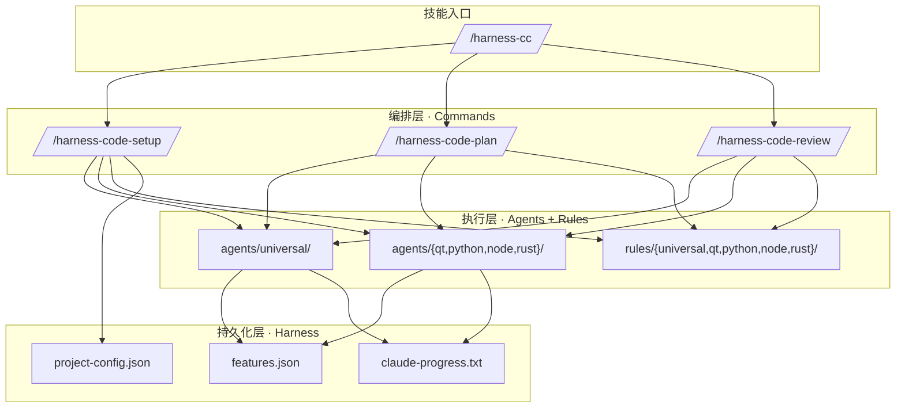

# harness-cc

`harness-cc` 是一个 Claude Code 技能，面向**需要多轮编码会话的复杂任务**。它不是一个普通模板，而是一个**编码工作流引擎**——输入 PRD+方案文档，自动拆解为可执行任务列表，按状态机逐个推进，验收后提交。支持 C++/Qt、Python、Node.js、Rust。

---

## 核心设计思想

### 为什么要用状态机？

Claude Code 在长周期开发中有几个固有问题：

| 问题 | harness-cc 的解法 |
|------|-------------------|
| **跨会话失忆** | 每次启动先读 `features.json` + `progress.txt`，恢复现场 |
| **一口气改太多** | 每轮只推进一个任务，不越界 |
| **过早宣布完成** | 硬规则：没有构建/测试证据，不得标记 `passed` |
| **缺少验证闭环** | 8 步工作流固化验收流程，不可跳过 |

### 三层架构



---

## 安装

```cmd
:: CMD
git clone https://github.com/jovetickop/Harness-CC.git %USERPROFILE%/.claude/skills/harness-cc
```

```powershell
# PowerShell
git clone https://github.com/jovetickop/Harness-CC.git $env:USERPROFILE/.claude/skills/harness-cc
```

安装后，在任意项目目录中执行 `/harness-cc` 即可激活。

## 可用命令

安装 `harness-cc` 后，以下命令在所有项目中可用：

| 命令 | 什么时候用 | 作用 |
|------|-----------|------|
| `/harness-cc` | **首次接入**，或每天开始编码时 | 总控入口。自动检测项目状态。首次使用时内部调用初始化流程，已有进度时读取状态引导下一步 |
| `/harness-code-plan` | 有新需求/任务需要拆解时 | 将 PRD（及方案文档，如有）转为 `features.json` 任务列表，每个任务含验收标准和测试命令 |
| `/harness-code-review` | 实现完成后验收 | 执行通用检查（构建+测试+代码质量）+ 按项目类型的专项验收检查。输出严重级别（high/medium/low）|

> 日常开发流程：`/harness-cc`（读状态）→ `/harness-code-plan`（拆任务）→ 实现 → `/harness-code-review`（验收）

---

## 完整工作流

技能被 `/harness-cc` 激活后，执行 8 步闭环：

### Step 1: 读取状态
读取 `.claude/harness/features.json` 和 `claude-progress.txt`，判断当前阶段。

### Step 2: 选择任务
- 优先继续 `in_progress` 任务
- 否则选依赖已满足且 priority 最高的 `pending` 任务
- 无任务时执行 `/harness-code-plan` 从 PRD/方案文档拆解新任务

### Step 3: 标记开始
```powershell
.\.claude\harness\update-progress.ps1 T001 in_progress "开始..."
```

### Step 4: 实现
按 project-type 选择对应语言 agent 执行。构建失败时使用 `build-doctor`，UI 改动使用 `ui-reviewer`。

### Step 5: 代码审查
使用 `code-reviewer` agent 审查：命名、嵌套、错误处理、测试覆盖、安全性。
- **critical/high**：必须修复后才能继续
- **medium/low**：记录待办后继续

### Step 6: 验证
执行构建命令和测试命令。可用 `run-regression.ps1` 一键执行。

### Step 7: 验收
执行 `/harness-code-review`：通用检查（构建+测试+代码质量）+ 语言专项检查。

### Step 8: 完成或失败
```powershell
.\.claude\harness\update-progress.ps1 T001 passed "说明"
# 或
.\.claude\harness\update-progress.ps1 T001 failed "失败原因"
```

通过后按 `rules/universal/git-workflow.md` 提交代码。然后重复 Step 1。

---

## 项目类型检测机制

首次使用时，技能自动检测目标项目的类型。按优先级：

```
1. 检测到 CMakeLists.txt
   ├── find_package(Qt → "cpp-qt"（激活 Qt 全套 agent + rules）
   ├── 不含 Qt → "cpp-cmake"（激活 C++/CMake 规则）
2. 检测到 Cargo.toml → "rust"
3. 检测到 package.json → "node"
4. 检测到 pyproject.toml / requirements.txt → "python"
5. 都检测不到 → "generic"
```

检测结果写入 `.claude/harness/project-config.json`，后续所有命令都读取该文件。

## Agent 选择规则

| 项目类型 | 架构设计 | 编码实现 | 测试 | UI 审查 |
|---------|---------|---------|------|--------|
| C++/Qt | `agents/qt/architect` | `agents/qt/task-implementer` | `agents/qt/test-engineer` | `agents/qt/ui-reviewer` |
| C++ (纯 CMake) | `agents/cpp-cmake/architect` | `agents/universal/task-implementer` | `agents/universal/test-engineer` | — |
| Python | `agents/python/architect` | `agents/universal/task-implementer` | `agents/python/test-engineer` | — |
| Node | `agents/node/architect` | `agents/universal/task-implementer` | `agents/node/test-engineer` | `agents/node/ui-reviewer` |
| Rust | `agents/rust/architect` | `agents/universal/task-implementer` | `agents/rust/test-engineer` | — |
| 通用 | — | `agents/universal/task-implementer` | `agents/universal/test-engineer` | — |

---

## 目录结构详解

```
harness-cc/                              ← 仓库根目录
├── .claude/                              ← 插件主目录（复制到项目）
│   ├── SKILL.md                          ← 技能入口。/harness-cc 激活
│   │
│   ├── agents/                           ← Agent 定义（纯 markdown）
│   │   ├── universal/                    ← 所有项目类型共同使用的通用 agent
│   │   ├── feature-planner.md            ← PRD/方案 → 任务列表（/harness-code-plan 内部使用）
│   │   ├── task-implementer.md           ← 单任务最小闭环实现
│   │   ├── test-engineer.md              ← 通用测试设计
│   │   ├── build-doctor.md               ← 构建诊断（支持 CMake、Cargo、npm 等）
│   │   └── code-reviewer.md              ← 代码审查（命名、错误处理、安全性）
│   ├── cpp-cmake/                         ← 纯 C++/CMake 插件（仅 cpp-cmake 项目激活）
│   ├── qt/                               ← C++/Qt 插件（仅 cpp-qt 项目激活）
│   ├── python/                           ← Python 插件（仅 python 项目激活）
│   ├── node/                             ← Node/Web 插件（仅 node 项目激活）
│   └── rust/                             ← Rust 插件（仅 rust 项目激活）
│
│   ├── commands/                           ← 斜杠命令定义
│   ├── harness-code-setup.md             ← /harness-code-setup：初始化 + 项目类型检测
│   ├── harness-code-plan.md              ← /harness-code-plan：PRD → 可执行任务
│   └── harness-code-review.md            ← /harness-code-review：通用 + 语言专项验收
│
│   ├── rules/                              ← 研发规范
│   ├── universal/                        ← 通用规范（所有项目）
│   │   ├── coding-style.md              ← 命名、注释、文件组织、格式
│   │   ├── testing.md                   ← 测试基线、验证策略
│   │   └── git-workflow.md              ← Commit 格式、分支约定
│   ├── cpp-cmake/                        ← 纯 C++/CMake 规范
│   ├── qt/                               ← Qt 专属规范
│   ├── python/                           ← Python 规范
│   ├── node/                             ← Node.js 规范
│   └── rust/                             ← Rust 规范
│
│   ├── hooks/                              ← 自动化钩子
│   ├── hooks.json                        ← PostToolUse：Write/Edit 后自动 clang-format
│   └── scripts/                          ← clang-format.sh + clang-format.ps1
│
│   ├── skills/
│   └── tdd-workflow/SKILL.md             ← 子技能：TDD 工作流，/tdd-workflow 激活
│
│   └── templates/
    ├── harness/                          ← 复制到目标项目 .claude/harness/ 的运行时
    │   ├── features.json                ← 任务清单与状态（核心数据）
    │   ├── project-config.json          ← 项目类型配置（/harness-code-setup 写入）
    │   ├── claude-progress.txt          ← 进度日志（追加写入，不可篡改）
    │   ├── update-progress.ps1          ← 状态流转（含依赖检查 + 冲突检测 + 自动报告）
    │   ├── coding-session.ps1           ← 会话入口（扫描状态）
    │   ├── run-regression.ps1           ← 一键构建+测试
    │   ├── init.ps1                     ← 首次初始化
    │   └── show-status.py               ← 状态概览（Python 2/3 双兼容）
    └── existing_project/                ← 回填到目标项目根目录
        ├── CLAUDE.md                    ← 项目 CLAUDE.md 模板（追加合并）
        ├── review-checklist.md          ← 验收清单
        └── cmake-adapter.md             ← CMake 接入原则
```

---

## Harness 状态引擎规则

### 状态流转

```
pending ──→ in_progress ──→ passed
                        └──→ failed ──→ in_progress（重试）
```

状态由 `update-progress.ps1` 脚本管理，每步都做合法性校验：

- `pending → in_progress`：检查 depends_on 是否全部 `passed`
- `in_progress → passed`：只能从 `in_progress` 变为 `passed`，必须有构建/测试证据
- `in_progress → failed`：必须提供失败原因
- `failed → in_progress`：重试

### 硬规则

- 同时只能有一个 `in_progress` 任务
- `depends_on` 未满足的任务不能开始
- 没有构建和测试结果，不得标记 `passed`
- 每轮必须更新 `claude-progress.txt`
- 每次状态流转后自动生成 `docs/reports/<任务编号>-描述.md`
- 失败任务默认保持 `failed`，不自动退回 `pending`

### CLAUDE.md 合并规则

目标项目已有 CLAUDE.md 时：
- **不覆盖**原有内容
- **追加** `harness-cc` 区块到文件末尾（`---` 分隔）
- 如已有 `harness-cc` 区块，则更新而非重复

---

## 与 tdd-workflow 技能的关系

`harness-cc` 是一个**工作流引擎**，tdd-workflow 是一个**编码方法论**。

```
/harness-cc → 启动工作流 → 选择任务 → /tdd-workflow → RED → GREEN → IMPROVE → 验收
```

在实现步骤中（Step 4），可以调用 `/tdd-workflow` 来指导具体的 TDD 循环。

---

## 统计

| 类别 | 数量 |
|------|------|
| Agent 定义 | 16（5 universal + 4 qt + 2 python + 3 node + 2 rust） |
| 规则文件 | 8（3 universal + 1 cpp-cmake + 2 qt + 1 python + 1 node + 1 rust） |
| 斜杠命令 | 3（harness-code-setup / harness-code-plan / harness-code-review） |
| 技能 | 2（harness-cc + tdd-workflow） |
| Harness 脚本 | 9 |
| 语言插件 | 5 种（cpp-qt / cpp-cmake / python / node / rust） |
