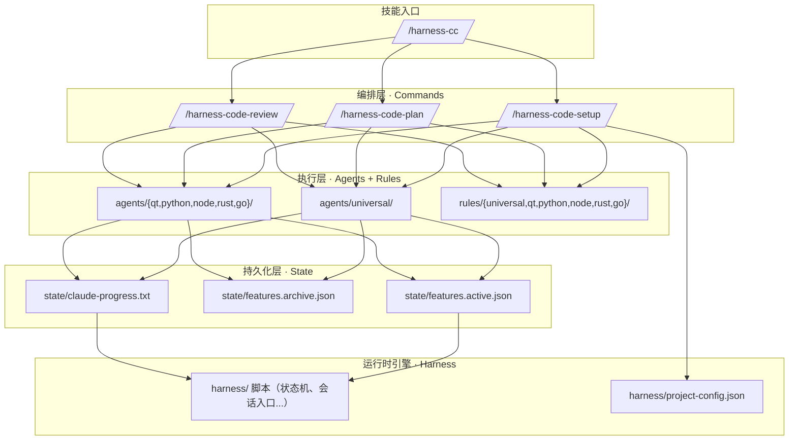

# harness-cc

`harness-cc` 是一个 Claude Code 技能，面向**需要多轮编码会话的复杂任务**。它不是一个普通模板，而是一个**编码工作流引擎**——输入 PRD+方案文档，自动拆解为可执行任务列表，按状态机逐个推进，验收后提交。支持 C++/Qt、C++ (纯 CMake)、Python、Node.js、Rust、Go。

---

## 核心设计思想

### 为什么要用状态机？

Claude Code 在长周期开发中有几个固有问题：

| 问题 | harness-cc 的解法 |
|------|-------------------|
| **跨会话失忆** | 每次启动先读 `state/features.json` + `state/claude-progress.txt`，恢复现场 |
| **一口气改太多** | 每轮只推进一个任务，不越界 |
| **过早宣布完成** | 硬规则：没有构建/测试证据，不得标记 `passed` |
| **缺少验证闭环** | 8 步工作流固化验收流程，不可跳过 |
| **钩子机制不完善** | PreToolUse 自动备份文件、PostToolUse 自动格式化、PreCompact 刷新状态、Stop 执行完整性检查 |
| **验证流程依赖人工** | Oracle 门控：标记 `passed` 前自动执行 `verify_command`，验证不通过自动退回 `failed` |
| **会话中断恢复困难** | 会话恢复机制：`/clear` 后自动从 `state/` 重建上下文，无需重新初始化 |
| **编码兼容问题** | 自动检测 GBK 编码文件，在读写时透明进行 GBK-UTF-8 双向转换，避免中文乱码 |
| **失败信息缺失** | 维护 `harness-history.jsonl` 记录每次失败上下文，内置 stall 检测识别卡住的任务 |
| **Token 消耗过高** | features.json 按需加载（分片机制），缩减约 78% 的 Token 消耗 |
| **脚本维护困难** | 核心脚本从 PowerShell 重写为 Python（update-progress、run-regression、validate-features），Python 2/3 双兼容 |
| **失败无历史** | 维护 `harness-history.jsonl` 记录每次状态转换，支持失败趋势分析和 stall 检测 |
| **任务串行阻塞** | 支持 `parallel_group` 字段，不同 group 的任务可并行执行 |
| **多语言格式化** | format-all.py 自动根据文件扩展名分发到 black/prettier/cargo fmt/clang-format |
| **依赖循环风险** | validate-features.py 使用 Kahn 算法检测 `depends_on` 循环引用并显示阻塞链 |
| **缺少 description** | features.json 任务新增 `description` 字段和 `metadata`（created_at/duration_seconds/session_id） |
| **Agent 文件冗余** | 提取 `base/task-implementer-core.md` 和 `base/test-engineer-core.md`，各语言 agent 通过 HTML 注释引用 |
| **硬编码默认值** | 构建/测试命令保持空值，由用户首次运行时填写，不再硬编码 "cmake --build build" |
| **缺少 Go 支持** | 新增 Go 语言支持：`agents/go/` + `rules/go/` + go.mod 检测 |
| **MCP 未集成** | `.mcp.json` 模板配置 filesystem + memory + git MCP 服务器 |
| **Web 搜索缺失** | build-doctor 和 architect agent 可在构建错误时搜索 Stack Overflow/GitHub Issues |

### 三层架构



---

## 安装

```cmd
:: CMD
git clone https://github.com/jovetickop/Harness-CC.git %USERPROFILE%/.claude/skills/harness-cc
```

```powershell
# PowerShell
git clone https://github.com/jovetickop/Harness-CC.git $env:USERPROFILE/.claude/skills/harness-cc
```

安装后，在任意项目目录中执行 `/harness-cc` 即可激活。

## 可用命令

安装 `harness-cc` 后，以下命令在所有项目中可用：

| 命令 | 什么时候用 | 作用 |
|------|-----------|------|
| `/harness-cc` | **首次接入**，或每天开始编码时 | 总控入口。自动检测项目状态。首次使用时内部调用初始化流程，已有进度时读取状态引导下一步 |
| `/harness-code-plan` | 有新需求/任务需要拆解时 | 将 PRD（及方案文档，如有）转为 `features.json` 任务列表，每个任务含验收标准和测试命令 |
| `/harness-code-review` | 实现完成后验收 | 执行通用检查（构建+测试+代码质量）+ 按项目类型的专项验收检查。输出严重级别（high/medium/low）|

> 日常开发流程：`/harness-cc`（读状态）→ `/harness-code-plan`（拆任务）→ 实现 → `/harness-code-review`（验收）

---

## 完整工作流

技能被 `/harness-cc` 激活后，执行 8 步闭环：

### Step 1: 读取状态
读取 `.claude/state/features.active.json` 和 `state/claude-progress.txt`，判断当前阶段。

### Step 2: 选择任务
- 优先继续 `in_progress` 任务
- 否则选依赖已满足且 priority 最高的 `pending` 任务
- 无任务时执行 `/harness-code-plan` 从 PRD/方案文档拆解新任务

### Step 3: 标记开始
```bash
.\.claude\harness\update-progress.ps1 T001 in_progress "开始..."
```

### Step 4: 实现
按 project-type 选择对应语言 agent 执行。构建失败时使用 `build-doctor`（支持 Web 搜索诊断），UI 改动使用 `ui-reviewer`。

### Step 5: 代码审查
使用 `code-reviewer` agent 审查：命名、嵌套、错误处理、测试覆盖、安全性。
- **critical/high**：必须修复后才能继续
- **medium/low**：记录待办后继续

### Step 6: 验证
执行构建命令和测试命令。可用 `.\.claude\harness\run-regression.ps1` 一键执行。

### Step 7: 验收
执行 `/harness-code-review`：通用检查（构建+测试+代码质量）+ 语言专项检查。

### Step 8: 完成或失败
```bash
.\.claude\harness\update-progress.ps1 T001 passed "说明"
# 或
.\.claude\harness\update-progress.ps1 T001 failed "失败原因"
```

通过后按 `rules/universal/git-workflow.md` 提交代码。然后重复 Step 1。

---

## 项目类型检测机制

首次使用时，技能自动检测目标项目的类型。按优先级：

```
1. 检测到 CMakeLists.txt
   ├── find_package(Qt → "cpp-qt"（激活 Qt 全套 agent + rules）
   ├── 不含 Qt → "cpp-cmake"（激活 C++/CMake 规则）
2. 检测到 Cargo.toml → "rust"
3. 检测到 go.mod → "go"
4. 检测到 package.json → "node"
5. 检测到 pyproject.toml / requirements.txt → "python"
6. 都检测不到 → "generic"
```

检测结果写入 `.claude/harness/project-config.json`，后续所有命令都读取该文件。

## Agent 选择规则

| 项目类型 | 架构设计 | 编码实现 | 测试 | UI 审查 |
|---------|---------|---------|------|--------|
| C++/Qt | `agents/qt/architect` | `agents/qt/task-implementer` | `agents/qt/test-engineer` | `agents/qt/ui-reviewer` |
| C++ (纯 CMake) | `agents/cpp-cmake/architect` | `agents/universal/task-implementer` | `agents/universal/test-engineer` | — |
| Python | `agents/python/architect` | `agents/universal/task-implementer` | `agents/python/test-engineer` | — |
| Node | `agents/node/architect` | `agents/universal/task-implementer` | `agents/node/test-engineer` | `agents/node/ui-reviewer` |
| Rust | `agents/rust/architect` | `agents/universal/task-implementer` | `agents/rust/test-engineer` | — |
| Go | `agents/go/architect` | `agents/universal/task-implementer` | `agents/go/test-engineer` | — |
| 通用 | — | `agents/universal/task-implementer` | `agents/universal/test-engineer` | — |

> 测试 agent 和实现 agent 的通用部分（输出格式、边界约束、验证要求等）已提取至 `agents/base/test-engineer-core.md` 和 `agents/base/task-implementer-core.md`。各语言 agent 仅保留语言专属内容。

---

## 目录结构详解

```
harness-cc/                              ← 仓库根目录
├── .claude/                              ← 插件主目录（复制到项目）
│   ├── SKILL.md                          ← 技能入口。/harness-cc 激活
│   │
│   ├── agents/                           ← Agent 定义（纯 markdown）
│   │   ├── universal/                    ← 所有项目类型通用 agent
│   │   │   ├── feature-planner.md        ← PRD/方案 → 任务列表
│   │   │   ├── task-implementer.md       ← 单任务最小闭环实现
│   │   │   ├── test-engineer.md          ← 通用测试设计
│   │   │   ├── build-doctor.md           ← 构建诊断（支持 Web 搜索）
│   │   │   └── code-reviewer.md          ← 代码审查
│   │   ├── base/                          ← 基础核心文件（被各语言 agent 引用）
│   │   │   ├── task-implementer-core.md   ← 通用任务实现核心
│   │   │   └── test-engineer-core.md      ← 通用测试理论核心
│   │   ├── cpp-cmake/                     ← 纯 C++/CMake 插件
│   │   ├── qt/                            ← C++/Qt 插件
│   │   ├── python/                        ← Python 插件
│   │   ├── node/                          ← Node/Web 插件
│   │   ├── rust/                          ← Rust 插件
│   │   └── go/                            ← Go 插件（go.mod 检测）
│   │
│   ├── commands/                      ← 斜杠命令定义
│   │   ├── harness-code-setup.md/ps1      ← 初始化 + 项目类型检测 + 状态迁移
│   │   ├── harness-code-plan.md           ← PRD → 可执行任务
│   │   └── harness-code-review.md         ← 通用 + 语言专项验收
│   │
│   ├── rules/                         ← 研发规范
│   │   ├── universal/                     ← 通用规范（所有项目共用）
│   │   │   ├── coding-style.md           ← 命名、注释、文件组织、格式
│   │   │   ├── testing.md                ← 测试基线、验证策略
│   │   │   └── git-workflow.md           ← Commit 格式、分支约定
│   │   ├── cpp-cmake/                     ← 纯 C++/CMake 规范
│   │   ├── qt/                            ← Qt 专属规范 + UI 架构
│   │   ├── python/                        ← Python 规范
│   │   ├── node/                          ← Node.js 规范
│   │   ├── rust/                          ← Rust 规范
│   │   └── go/                            ← Go 规范
│   │
│   │   └── cpp-cmake/encoding.md          ← GBK 编码说明
│   │
│   ├── hooks/                         ← 自动化钩子（4 种）
│   │   ├── hooks.json                     ← 钩子注册（PreToolUse / PostToolUse / PreCompact / Stop）
│   │   └── scripts/                       ← 钩子脚本
│   │       ├── pre-tool-use.sh/.ps1      ← PreToolUse：备份 + GBK→UTF-8
│   │       ├── pre-compact.sh/.ps1       ← PreCompact：进度刷写
│   │       ├── stop-check.sh/.ps1        ← Stop：完整性检查
│   │       ├── clang-format.sh/.ps1      ← C/C++ 格式化
│   │       ├── format-all.py             ← 多语言格式化分发
│   │       └── encoding-bridge.py        ← GBK/UTF-8 编码桥接
│   │
│   ├── scripts/                            ← 技能自带 Python 脚本（Phase 2 新增）
│   │   ├── session-catchup.py             ← 会话恢复工具（唯一保留）
│   │   └── （其余 Python 脚本已迁移到 harness/，使用 PowerShell 版本）
│   │
│   ├── skills/
│   │   └── tdd-workflow/SKILL.md          ← 子技能：TDD 工作流
│   │
│   └── templates/
│       ├── harness/                       ← 复制到项目的运行时引擎
│       │   ├── update-progress.ps1        ← 状态流转引擎（PS 版，保留降级）
│       │   ├── coding-session.ps1         ← 会话入口
│       │   ├── run-regression.ps1         ← 一键构建+测试（PS 版）
│       │   ├── init.ps1                   ← 首次初始化
│       │   ├── show-status.py             ← 状态概览
│       │   ├── project-config.json        ← 项目类型配置
│       │   └── README.md                  ← 运行时说明
│       ├── state/                         ← 复制到项目的状态文件
│       │   ├── features.json              ← 通用任务清单（兼容旧版）
│       │   ├── features.active.json       ← 活动任务清单（Token 优化分片）
│       │   ├── features.archive.json      ← 已完成任务归档
│       │   └── claude-progress.txt        ← 进度日志
│       ├── .mcp.json                      ← MCP 服务器配置模板
│       └── existing_project/              ← 回填到项目根目录的模板
│           ├── CLAUDE.md                  ← CLAUDE.md 模板
│           ├── review-checklist.md        ← 验收清单
│           └── cmake-adapter.md           ← CMake 接入原则
```

---

## Harness 状态引擎规则

### 状态流转

```
pending ──→ in_progress ──→ passed ──→ completed（别名）
                        └──→ failed ──→ in_progress（重试）
```

状态由 `update-progress.py` 脚本管理，每步都做合法性校验：

- `pending → in_progress`：检查 depends_on 是否全部 `passed`
- `in_progress → passed`：只能从 `in_progress` 变为 `passed`，自动执行 Oracle 验证门控
- `in_progress → failed`：必须提供失败原因
- `failed → in_progress`：重试

### 并行组规则

- 相同 `parallel_group` 内只能有一个 `in_progress` 任务
- 不同 `parallel_group` 的任务可以并行执行
- `parallel_group` 为空时视为默认组（完全串行，向后兼容）

### 硬规则

- `depends_on` 未满足的任务不能开始
- 没有构建和测试结果，不得标记 `passed`
- 每轮必须更新 `claude-progress.txt`
- 每次状态流转后自动生成 `docs/reports/<任务编号>-描述.md`
- 每个状态转换记录到 `harness-history.jsonl`（追加写入，不可篡改）
- 失败任务默认保持 `failed`，不自动退回 `pending`
- verify_command 必须由脚本独立执行，AI 不可修改

### Oracle 验证门控

当 `project-config.json` 中配置了 `verify.verify_enabled = true` 时，每次任务从 `in_progress` 转为 `passed` 前自动执行 `verify_command`：

- 验证通过（exit 0）→ 允许转为 `passed`
- 验证失败（exit 非 0）→ 自动转为 `failed`
- 验证超时 → 自动转为 `failed`
- 验证输出写入 `claude-progress.txt`

### CLAUDE.md 合并规则

目标项目已有 CLAUDE.md 时：
- **不覆盖**原有内容
- **追加** `harness-cc` 区块到文件末尾（`---` 分隔）
- 如已有 `harness-cc` 区块，则更新而非重复

---

## 使用指南

### 1. 安装/初始化

```bash
# 在目标项目目录执行
/harness-cc
# 技能自动检测项目类型，复制对应 agents/rules/scripts
```

首次使用时，技能自动检测项目类型（CMakeLists.txt、Cargo.toml、go.mod、package.json、pyproject.toml），复制对应的 agents、rules、hooks 到 `.claude/` 目录，并创建 `features.json` 初始任务列表。

### 2. 从 PRD 拆解任务

```bash
# 提供方案文档后执行
/harness-code-plan
# 自动生成 features.json 任务列表
```

### 3. 查看当前状态

```bash
.\.claude\harness\show-status.ps1
# 输出示例:
# Oracle 验证门: 已启用 | 命令: .\harness\run-regression.ps1 | 超时: 120s
# 任务总数: 6 | 已通过: 2 | 失败: 0 | 待处理: 3
# 进行中: T003 实现登录模块 (持续 15 分钟)
# 下一个可执行任务: T004 用户注册功能 (priority=90)
# 被依赖阻塞: 1 个任务
```

### 4. 执行一个任务（完整工作流）

```bash
# Step 1: 标记开始
.\.claude\harness\update-progress.ps1 T003 in_progress "开始实现登录模块"

# Step 2: 阅读对应语言的 architect agent 指导
# Step 3: 实现代码
# Step 4: 代码审查
# Step 5: 构建验证
.\.claude\harness\run-regression.ps1

# Step 6: 验收审查
/harness-code-review

# Step 7: 标记完成（自动触发 Oracle 验证）
.\.claude\harness\update-progress.ps1 T003 passed "登录模块实现完成"
```

### 5. GBK 编码项目配置

```json
// .claude/harness/project-config.json
{
  "project-type": "cpp-cmake",
  "encoding": "gbk",
  "verify": {
    "verify_enabled": true,
    "verify_command": ".\\.claude\\harness\\run-regression.ps1",
    "verify_timeout_seconds": 120
  }
}
```

开启后 PreToolUse 自动 GBK→UTF-8 转码，PostToolUse 自动 UTF-8→GBK 回转。文件始终保持 GBK 编码，评审平台不乱码。

### 6. 会话恢复

如果 `/clear` 或中断：
```bash
python .claude/scripts/session-catchup.py
# 自动扫描 Claude Code 会话文件，输出恢复报告
# 显示最近 5 条用户消息、features.json 写入事件、任务状态概览
# 然后继续工作流
```

或者：
```bash
.\.claude\harness\show-status.ps1
# 查看当前任务状态，直接从 Step 2 继续
```

### 7. 并行任务

在 `features.json` 中为任务设置 `parallel_group` 后，不同 group 的任务可以并行执行：

```json
{
  "tasks": [
    {
      "id": "T001",
      "name": "后端 API",
      "status": "in_progress",
      "parallel_group": "backend",
      "depends_on": []
    },
    {
      "id": "T002",
      "name": "前端界面",
      "status": "pending",
      "parallel_group": "frontend",
      "depends_on": []
    }
  ]
}
```

T001 和 T002 分属不同 group，可以同时在两个会话中独立执行。

### 8. 验证架构正确性

```bash
# 验证 features.json 结构（含循环依赖检测）
.\.claude\harness\validate-features.ps1
# 输出:
# PASSED: 6 个任务，结构验证通过
# 或
# FAILED: 检测到循环依赖: T001 -> T002 -> T003 -> T001
```

---

## Hooks 配置

`harness-cc` 在 `.claude/hooks/hooks.json` 中注册了 4 个自动化钩子，由 Claude Code 运行时自动触发。

| Hook | 触发时机 | 作用 |
|------|---------|------|
| **PreToolUse** | Write/Edit 工具调用前 | 自动备份 `features.json` 到 `.bak.时间戳`（保留最近 5 个）；如果项目启用 GBK 编码，自动将源文件转为 UTF-8 |
| **PostToolUse** | Write/Edit 工具调用后 | 自动运行 `clang-format` 格式化 C/C++ 代码；运行 `format-all.py` 多语言格式化；如果项目启用 GBK 编码，将文件转回 GBK |
| **PreCompact** | 上下文压缩前 | 向 `claude-progress.txt` 追加 `[COMPACT]` 时间戳标记行，输出任务完成摘要（如 `3/5 任务完成`） |
| **Stop** | 会话结束/退出时 | 解析 `features.json`，检查是否有 `in_progress` 状态的未完成任务，输出中文警告提醒 |

四个钩子都以 `exit 0` 保证不阻塞主流程。钩子脚本同时提供 `.ps1`（Windows）和 `.sh`（Linux/macOS）版本。

---

## GBK 编码自动转换

针对 Windows 平台中文项目使用 GBK 编码（含 GB2312/GB18030）的场景，harness-cc 通过 PreToolUse 和 PostToolUse 钩子自动处理编码转换。AI 工具链全程使用 UTF-8 内部表示，项目文件保持 GBK 编码。

### 配置方式

在项目 `.claude/harness/project-config.json` 中设置 `encoding` 字段：

```json
{
  "encoding": "gbk"
}
```

设置为 `"gbk"` 后，encoding-bridge.py 自动完成以下转换：

| 钩子阶段 | 转换方向 | 说明 |
|---------|---------|------|
| PreToolUse (Write/Edit 前) | GBK → UTF-8 | 将 GBK 编码的源文件转为 UTF-8，确保 AI 正确读取和修改 |
| PostToolUse (Write/Edit 后) | UTF-8 → GBK | 格式化后自动转回 GBK，保持项目原始编码 |

### Linux 编译标志

如果项目需要在 Linux 下交叉编译 Windows 目标且源文件为 GBK 编码，在 CMakeLists.txt 中添加：

```cmake
# 通知 GCC/Clang 源文件为 GBK 编码，生成的可执行文件使用 UTF-8
set(CMAKE_CXX_FLAGS "${CMAKE_CXX_FLAGS} -finput-charset=gbk -fexec-charset=utf-8")
set(CMAKE_C_FLAGS "${CMAKE_C_FLAGS} -finput-charset=gbk -fexec-charset=utf-8")
```

MSVC 编译 Windows 版本通常无需额外配置，MSVC 默认使用系统本地编码。

---

## MCP 集成

`harness-cc` 通过 `.mcp.json` 模板集成 3 个 MCP 服务器：

| MCP 工具 | 用途 |
|---------|------|
| Filesystem MCP | 用于读写 features.json 等状态文件，避免编码问题 |
| Memory MCP | 用于对 `harness-history.jsonl` 进行语义查询，分析失败模式和任务趋势 |
| Git MCP | 版本控制工具 |

在安装时模板自动复制到目标项目根目录。如不需要，可删除 `.mcp.json`。

---

## 与 tdd-workflow 技能的关系

`harness-cc` 是一个**工作流引擎**，tdd-workflow 是一个**编码方法论**。

```
/harness-cc → 启动工作流 → 选择任务 → /tdd-workflow → RED → GREEN → IMPROVE → 验收
```

在实现步骤中（Step 4），可以调用 `/tdd-workflow` 来指导具体的 TDD 循环。

---

## Python 脚本速查

| 脚本 | 用途 | 替代的 PS 脚本 |
|------|------|---------------|
| `scripts/update-progress.py` | 状态机引擎（含 Oracle 验证、stall 检测、归档） | `templates/harness/update-progress.ps1` |
| `scripts/run-regression.py` | 一键构建+测试运行器 | `templates/harness/run-regression.ps1` |
| `scripts/validate-features.py` | 结构校验 + 循环依赖检测 | `templates/harness/validate-features.ps1` |
| `scripts/show-status.py` | 状态显示（增强版：持续时间+预测+失败趋势） | — |
| `scripts/session-catchup.py` | 会话恢复（/clear 后） | — |
| `hooks/scripts/format-all.py` | 多语言格式化分发 | — |
| `hooks/scripts/encoding-bridge.py` | GBK/UTF-8 编码桥接 | — |

---

## 统计

| 类别 | 数量 |
|------|------|
| Agent 定义 | 20（含 base/ 核心 + 6 种语言 + 5 个通用 + 前端） |
| 规则文件 | 10（3 universal + 1 cpp-cmake + 2 qt + 1 python + 1 node + 1 rust + 1 go） |
| 斜杠命令 | 3（harness-code-setup / harness-code-plan / harness-code-review） |
| 技能 | 2（harness-cc + tdd-workflow） |
| Harness 脚本 | 9（含 5 Python + 4 PS） |
| 语言插件 | 6 种（cpp-qt / cpp-cmake / python / node / rust / go） |
| Hooks 脚本 | 11（pre-tool-use / pre-compact / stop-check / clang-format 双版本 + format-all.py + encoding-bridge.py） |
