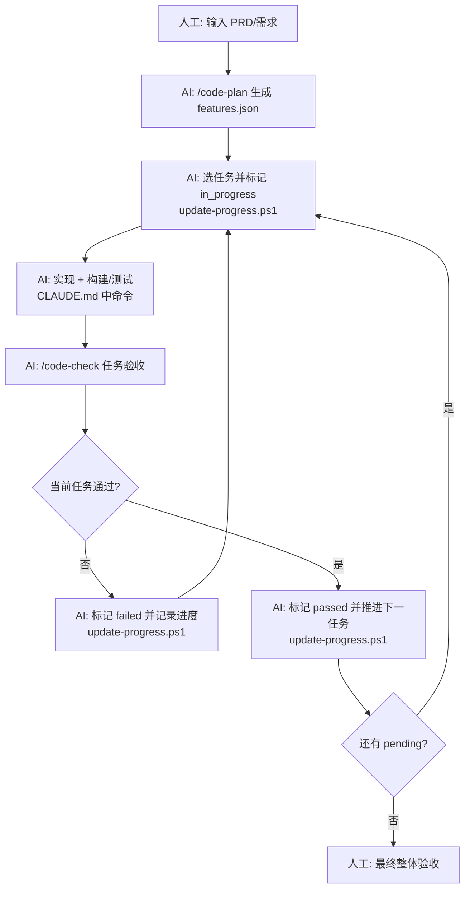

# ty-qt-ai-plugin

`ty-qt-ai-plugin` 是同元整理的一套面向多技术栈（C++/Qt、Python、Node.js、Rust）的 Claude Code 长任务开发工作流插件。它参考 Anthropic 提出的 [effective harnesses](https://www.anthropic.com/engineering/effective-harnesses-for-long-running-agents) 概念，把任务推进的高频研发动作固化为可复用闭环，核心目标：

- **配置即代码**：用清晰、可维护的工程化插件配置，解决 AI 长任务的失控问题。
- **状态化执行**：将任务的推进与严格的闭环验证深度绑定，确保每一步都有据可循、有源可溯。
- **插件化架构**：按技术栈（qt / python / node / rust）分组资产，自动检测项目类型并接入对应插件。

## 操作手册

1. 将整个 `ty-qt-ai-plugin/.claude` 目录下的所有内容拷贝到目标仓库的根目录；
2. 在目标仓库根目录启动 Claude Code；
3. 直接执行：`/code-setup`，自动检测项目类型（C++/Qt、Python、Node.js、Rust 等），复制对应插件资产，不覆盖业务代码。

## 长任务自动执行Agent原理

这套工作流的核心，不是让 AI 工作更久，而是解决长周期 Agent 在工程落地中的几个关键问题：

- **跨上下文失忆**：任务一长，AI 很容易忘记上一轮改了什么、做到哪一步。
- **一次改太多**：在 C++/Qt 项目里，UI、业务和构建链路相互牵动，Agent 很容易一口气把工程改乱。
- **过早宣布完成**：代码写完不等于任务完成，真正的验收还包括构建结果、交互链路、对象生命周期和线程安全。
- **缺少验证闭环**：没有固定的构建、测试和评审流程，AI 很难确认自己是否真的做对了。
- **每轮都在重新上手**：没有统一的状态记录和任务清单，Agent 每次都要重新理解项目现状。

流程图如下，核心是 AI **每一轮都先弄清现状，再只推进一个可验证的小目标，并在离开前把现场收拾干净：**

- 人工节点：`输入 PRD/需求`、`最终整体验收`
- AI 自动节点：`/code-plan`、`update-progress.ps1` 状态流转、`CLAUDE.md` 中构建/测试命令、`/code-check`



## 仓库内容

### 模板

当前仓库是模板源目录，核心结构如下：

```text
ty-qt-ai-plugin/
├── .claude/                                # 插件主目录
│   ├── agents/                             # 智能体角色（按目录分组）
│   │   ├── universal/                      # 跨项目通用智能体
│   │   │   ├── feature-planner.md
│   │   │   ├── task-implementer.md
│   │   │   ├── test-engineer.md
│   │   │   ├── build-doctor.md
│   │   │   └── code-reviewer.md
│   │   ├── qt/                             # C++/Qt 专用智能体
│   │   │   ├── architect.md
│   │   │   ├── task-implementer.md
│   │   │   ├── test-engineer.md
│   │   │   └── ui-reviewer.md
│   │   ├── python/                         # Python 专用智能体
│   │   │   ├── architect.md
│   │   │   └── test-engineer.md
│   │   ├── node/                           # Node.js 专用智能体
│   │   │   ├── architect.md
│   │   │   ├── test-engineer.md
│   │   │   └── ui-reviewer.md
│   │   └── rust/                           # Rust 专用智能体
│   │       ├── architect.md
│   │       └── test-engineer.md
│   ├── commands/                           # /code-setup /code-plan /code-check 命令
│   │   ├── code-setup.md
│   │   ├── code-plan.md
│   │   └── code-check.md
│   ├── rules/                              # 研发规范（按目录分组）
│   │   ├── universal/                      # 跨项目通用规范
│   │   │   ├── coding-style.md
│   │   │   ├── testing.md
│   │   │   └── git-workflow.md
│   │   ├── qt/                             # C++/Qt 专用规范
│   │   │   ├── best-practices.md
│   │   │   └── ui-architecture.md
│   │   ├── python/                         # Python 专用规范
│   │   │   └── best-practices.md
│   │   ├── node/                           # Node.js 专用规范
│   │   │   └── best-practices.md
│   │   └── rust/                           # Rust 专用规范
│   │       └── best-practices.md
│   ├── hooks/                              # 自动化钩子
│   │   ├── hooks.json
│   │   └── scripts/
│   │       ├── clang-format.sh
│   │       └── clang-format.ps1
│   ├── skills/                             # Skill 技能
│   │   └── tdd-workflow/
│   └── templates/                          # 初始化模板
│       ├── CLAUDE.md
│       ├── .clang-format
│       ├── .mcp.json
│       ├── existing_project/               # 存量工程接入通用模板
│       │   ├── CLAUDE.md
│       │   ├── review-checklist.md
│       │   ├── cmake-adapter.md
│       │   └── harness/
│       └── harness/                        # 长任务自动化执行约束
│           ├── README.md                   # 执行约束说明
│           ├── features.json               # 任务状态机
│           ├── claude-progress.txt         # 进度日志
│           ├── update-progress.ps1         # 状态流转与报告落盘
│           ├── show-status.py              # 可执行任务与失败任务概览
│           ├── coding-session.ps1          # 会话入口（状态扫描）
│           ├── run-regression.ps1          # 构建 + 回归测试
│           ├── init.ps1                    # harness 初始化
└── README.md
```

### 初始化后的仓库分布

执行 `/code-setup` 后，目标仓库落位为以下结构。

#### 存量工程接入

```text
<your-repo>/
├── src/                                    # 现有业务代码，保持不覆盖
├── include/
├── ui/
├── tests/
├── .claude/                                # 新增/合并工作流配置
│   ├── agents/
│   ├── commands/
│   ├── rules/
│   ├── hooks/
│   └── harness/                            # 长任务自动化执行约束
│       ├── features.json                   # 任务状态
│       ├── claude-progress.txt             # 任务进度
│       ├── update-progress.ps1             # 状态流转与报告更新
│       ├── show-status.py                  # 状态概览
│       ├── coding-session.ps1              # 会话入口
│       ├── run-regression.ps1              # 构建 + 回归测试
│       ├── init.ps1                        # harness 初始化
│       ├── update-progress.bat
│       ├── coding-session.bat
│       └── init.bat
├── CLAUDE.md                               # 写入自动识别出的命令和项目类型
├── review-checklist.md
└── cmake-adapter.md
```
