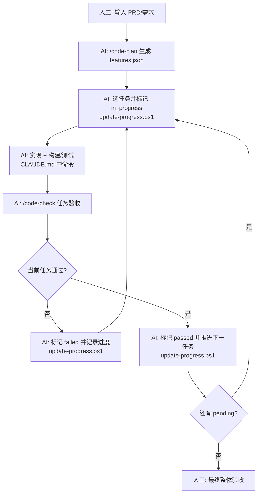

# CodeHarness

`CodeHarness` 是一套面向多技术栈（C++/Qt、Python、Node.js、Rust）的 Claude Code 长任务开发工作流插件。它面向**需要多轮编码会话的复杂任务**（简单任务同样可用），参考 Anthropic 提出的 [effective harnesses](https://www.anthropic.com/engineering/effective-harnesses-for-long-running-agents) 概念，把任务推进的高频研发动作固化为可复用闭环，核心目标：

- **配置即代码**：用清晰、可维护的工程化插件配置，解决 AI 长任务的失控问题。
- **状态化执行**：将任务的推进与严格的闭环验证深度绑定，确保每一步都有据可循、有源可溯。
- **插件化架构**：按技术栈（qt / python / node / rust）分组资产，自动检测项目类型并接入对应插件。

## 操作手册

1. 将整个 `CodeHarness/.claude` 目录下的所有内容拷贝到目标仓库的根目录；
2. 在目标仓库根目录启动 Claude Code；
3. 直接执行：`/code-setup`，自动检测项目类型（C++/Qt、Python、Node.js、Rust 等），复制对应插件资产，不覆盖业务代码。

## 长任务自动执行Agent原理

这套工作流的核心，不是让 AI 工作更久，而是解决长周期 Agent 在工程落地中的几个关键问题：

- **跨上下文失忆**：任务一长，AI 很容易忘记上一轮改了什么、做到哪一步。
- **一次改太多**：UI、业务和构建链路相互牵动，Agent 很容易一口气把工程改乱。
- **过早宣布完成**：代码写完不等于任务完成，真正的验收还包括构建结果、交互链路、对象生命周期和线程安全。
- **缺少验证闭环**：没有固定的构建、测试和评审流程，AI 很难确认自己是否真的做对了。
- **每轮都在重新上手**：没有统一的状态记录和任务清单，Agent 每次都要重新理解项目现状。

流程图如下，核心是 AI **每一轮都先弄清现状，再只推进一个可验证的小目标，并在离开前把现场收拾干净：**

- 人工节点：`输入 PRD/需求`、`最终整体验收`
- AI 自动节点：`/code-plan`、`update-progress.ps1` 状态流转、`CLAUDE.md` 中构建/测试命令、`/code-check`



## 仓库内容

### 模板

当前仓库是模板源目录，核心结构如下：

```text
CodeHarness/
├── .claude/                                # 插件主目录
│   ├── agents/                             # 智能体角色（按目录分组）
│   │   ├── universal/                      # 跨项目通用智能体
│   │   │   ├── feature-planner.md
│   │   │   ├── task-implementer.md
│   │   │   ├── test-engineer.md
│   │   │   ├── build-doctor.md
│   │   │   └── code-reviewer.md
│   │   ├── qt/                             # C++/Qt 专用智能体
│   │   │   ├── architect.md
│   │   │   ├── task-implementer.md
│   │   │   ├── test-engineer.md
│   │   │   └── ui-reviewer.md
│   │   ├── python/                         # Python 专用智能体
│   │   │   ├── architect.md
│   │   │   └── test-engineer.md
│   │   ├── node/                           # Node.js 专用智能体
│   │   │   ├── architect.md
│   │   │   ├── test-engineer.md
│   │   │   └── ui-reviewer.md
│   │   └── rust/                           # Rust 专用智能体
│   │       ├── architect.md
│   │       └── test-engineer.md
│   ├── commands/                           # /code-setup /code-plan /code-check 命令
│   │   ├── code-setup.md
│   │   ├── code-plan.md
│   │   └── code-check.md
│   ├── rules/                              # 研发规范（按目录分组）
│   │   ├── universal/                      # 跨项目通用规范
│   │   │   ├── coding-style.md
│   │   │   ├── testing.md
│   │   │   └── git-workflow.md
│   │   ├── qt/                             # C++/Qt 专用规范
│   │   │   ├── best-practices.md
│   │   │   └── ui-architecture.md
│   │   ├── python/                         # Python 专用规范
│   │   │   └── best-practices.md
│   │   ├── node/                           # Node.js 专用规范
│   │   │   └── best-practices.md
│   │   └── rust/                           # Rust 专用规范
│   │       └── best-practices.md
│   ├── hooks/                              # 自动化钩子
│   │   ├── hooks.json
│   │   └── scripts/
│   │       ├── clang-format.sh
│   │       └── clang-format.ps1
│   ├── skills/                             # Skill 技能
│   │   └── tdd-workflow/
│   └── templates/                          # 初始化模板
│       ├── CLAUDE.md
│       ├── .clang-format
│       ├── .mcp.json
│       ├── existing_project/               # 存量工程接入通用模板
│       │   ├── CLAUDE.md
│       │   ├── review-checklist.md
│       │   ├── cmake-adapter.md
│       │   └── harness/
│       └── harness/                        # 长任务自动化执行约束
│           ├── README.md                   # 执行约束说明
│           ├── features.json               # 任务状态机
│           ├── project-config.json         # 项目类型配置
│           ├── claude-progress.txt         # 进度日志
│           ├── update-progress.ps1         # 状态流转与报告落盘
│           ├── show-status.py              # 可执行任务与失败任务概览
│           ├── coding-session.ps1          # 会话入口（状态扫描）
│           ├── run-regression.ps1          # 构建 + 回归测试
│           ├── init.ps1                    # harness 初始化
└── README.md
```

### 初始化后的仓库分布

执行 `/code-setup` 后，目标仓库落位为以下结构。

#### 存量工程接入

```text
<your-repo>/
├── src/                                    # 现有业务代码，保持不覆盖
├── include/
├── ui/
├── tests/
├── .claude/                                # 新增/合并工作流配置
│   ├── agents/
│   ├── commands/
│   ├── rules/
│   ├── hooks/
│   └── harness/                            # 长任务自动化执行约束
│       ├── features.json                   # 任务状态
│       ├── claude-progress.txt             # 任务进度
│       ├── update-progress.ps1             # 状态流转与报告更新
│       ├── show-status.py                  # 状态概览
│       ├── coding-session.ps1              # 会话入口
│       ├── run-regression.ps1              # 构建 + 回归测试
│       ├── init.ps1                        # harness 初始化
│       ├── update-progress.bat
│       ├── coding-session.bat
│       └── init.bat
├── CLAUDE.md                               # 写入自动识别出的命令和项目类型
├── review-checklist.md
└── cmake-adapter.md
```

---

# 功能清单

> 系统化盘点模板工作流的所有已支持功能。

---

## 一、任务状态引擎（Harness）

用于跨会话管理长任务的生命周期。

| 功能 | 文件 | 说明 |
|------|------|------|
| **状态机** | `update-progress.ps1` | `pending → in_progress → passed/failed`，严格校验流转合法性 |
| **依赖管理** | `update-progress.ps1` | `depends_on` 前置检查：确保依赖已 `passed` 且任务 ID 存在 |
| **冲突检测** | `update-progress.ps1` | 阻止同时存在多个 `in_progress` 任务 |
| **AutoPush** | `update-progress.ps1` | 可选 `-AutoPush` 参数，状态变更后自动 git commit + push |
| **进度日志** | `claude-progress.txt` | 追加写入 `时间戳 \| ID \| 旧状态 → 新状态 \| 说明` |
| **自动报告** | `update-progress.ps1` | 每次状态流转自动生成 `docs/reports/<TaskId>-<name>.md` |
| **状态概览** | `show-status.py` | 输出：总数/通过/失败/进行中/下一个可执行/被阻塞数 |
| **项目配置** | `project-config.json` | `/code-setup` 写入的项目类型和命令信息，供 `/code-check` 使用 |
| **BAT 包装** | `*.bat` | 所有 PS1 脚本都有同名的 `.bat` 包装，CMD 下直接调用 |

**状态流转规则：**

```
pending ──→ in_progress
in_progress ──→ passed
in_progress ──→ failed
failed ──→ in_progress (重试)
failed ──→ pending (仅人工确认后可重排)
```

---

## 二、会话管理

| 入口 | 文件 | 用途 |
|------|------|------|
| **初始化** | `init.ps1` / `init.bat` | 首次运行：创建 harness 目录、检查 features.json |
| **会话开始** | `coding-session.ps1` / `coding-session.bat` | 每次编码会话入口，加载当前任务概览 |
| **一键回归** | `run-regression.ps1` | 顺序执行构建 + 测试命令 |

---

## 三、Agent 角色（16 个）

每个 Agent 是独立的 `.md` 定义文件，位于 `.claude/agents/`，按目录分组：

### universal/（5 个，跨项目通用）

| Agent | 职责 | 解决什么问题 |
|-------|------|-------------|
| `feature-planner` | 把 PRD 拆成可执行的小任务 | 需求 → features.json |
| `task-implementer` | 单任务最小闭环实现 | 一次只做一个任务，不越界 |
| `test-engineer` | 设计测试矩阵、补 test_command | 测试覆盖不够怎么办 |
| `build-doctor` | 诊断构建失败 | 构建挂了怎么办 |
| `code-reviewer` | 代码审查 | 代码质量把关 |

### qt/（4 个，C++/Qt 专用）

| Agent | 职责 | 解决什么问题 |
|-------|------|-------------|
| `architect` | 编码前评估类设计、生命周期、线程风险 | "这么做会踩什么坑" |
| `task-implementer` | Qt 专用实现 | Qt 编码任务 |
| `test-engineer` | Qt 测试方案 | Qt 测试覆盖 |
| `ui-reviewer` | 审查布局、sizePolicy、反馈、文案 | 界面可用性把关 |

### python/（2 个，Python 专用）

| Agent | 职责 | 解决什么问题 |
|-------|------|-------------|
| `architect` | Python 方案设计 | Python 项目架构 |
| `test-engineer` | Python 测试方案 | Python 测试覆盖 |

### node/（3 个，Node.js 专用）

| Agent | 职责 | 解决什么问题 |
|-------|------|-------------|
| `architect` | Node.js 方案设计 | Node.js 项目架构 |
| `test-engineer` | Node.js 测试方案 | Node.js 测试覆盖 |
| `ui-reviewer` | Web UI 审查 | Web UI 可用性 |

### rust/（2 个，Rust 专用）

| Agent | 职责 | 解决什么问题 |
|-------|------|-------------|
| `architect` | Rust 方案设计 | Rust 项目架构 |
| `test-engineer` | Rust 测试方案 | Rust 测试覆盖 |

---

## 四、斜杠命令（3 个）

位于 `.claude/commands/`：

### `/code-setup`
- 自动检测项目类型（cpp-qt / python / node / rust）
- 存量工程：只补 `.claude/` 配置，不改已有源码
- 自动探测：配置命令 → 构建命令 → 测试命令
- 将探测结果写入根目录 `CLAUDE.md`

### `/code-plan`
- 将 PRD 转为 `features.json` 任务列表
- 自动包含：`id`、`name`、`depends_on`、`priority`、`test_command`、`acceptance_criteria`
- 规则：依赖链正确、粒度够小

### `/code-check`
- 通用验收检查：构建正确性、测试覆盖、代码规范合规、harness 状态一致性
- 按项目类型的专项验收（Qt: QObject 所有权、MOC/UIC/RCC；Node: npm audit 等）
- 输出严重级别：high / medium / low

---

## 五、编码规范（10 份规则文件）

位于 `.claude/rules/`，按目录分组：

### universal/（3 份，跨项目通用）

| 规则文件 | 覆盖内容 |
|----------|---------|
| `coding-style.md` | 通用命名、文件组织、注释、格式、immutability |
| `testing.md` | 测试基线、验证策略、任务通过规则 |
| `git-workflow.md` | Conventional Commits、提交前检查清单 |

### qt/（2 份，C++/Qt 专用）

| 规则文件 | 覆盖内容 |
|----------|---------|
| `best-practices.md` | QObject 父子关系、新式信号槽语法、非主线程不操作 UI、RAII |
| `ui-architecture.md` | 布局优先、面板边界、按钮位置和反馈、无歧义文案 |

### python/（1 份）

| 规则文件 | 覆盖内容 |
|----------|---------|
| `best-practices.md` | Python 最佳实践 |

### node/（1 份）

| 规则文件 | 覆盖内容 |
|----------|---------|
| `best-practices.md` | Node.js 最佳实践 |

### rust/（1 份）

| 规则文件 | 覆盖内容 |
|----------|---------|
| `best-practices.md` | Rust 最佳实践 |

---

## 六、自动化钩子

| 触发时机 | 匹配工具 | 动作 |
|---------|----------|------|
| **PostToolUse** | `Write\|Edit` | 对 `.cpp\|.cc\|.cxx\|.c\|.h\|.hpp\|.hxx` 文件自动执行 `clang-format` |
| **双后备** | — | Bash 优先，失败则退到 PowerShell |

---

## 七、MCP 集成

位于 `.claude/templates/.mcp.json`：

| 服务器 | 类型 | 用途 |
|--------|------|------|
| `filesystem` | stdio | 安全文件系统访问 |
| `git` | stdio | Git 仓库操作 |
| `memory` | stdio | 知识图谱持久化 |

---

## 八、TDD 工作流

位于 `.claude/skills/tdd-workflow/SKILL.md`：

| 能力 | 说明 |
|------|------|
| **TDD 闭环** | RED → GREEN → IMPROVE |
| **测试框架覆盖** | GoogleTest + QTest + CTest |
| **异步测试模式** | QSignalSpy、QTRY_VERIFY |
| **常见错误对照** | 6 组错误 vs 正确做法 |

---

## 统计一览

| 类别 | 数量 |
|------|------|
| Agent 定义 | 16（5 universal + 4 qt + 2 python + 3 node + 2 rust） |
| 斜杠命令 | 3 |
| 规则文件 | 10（3 universal + 2 qt + 1 python + 1 node + 1 rust） |
| 钩子规则 | 1（PostToolUse） |
| Skill | 1（TDD） |
| MCP 服务器默认配置 | 3 |
| **总计资产文件** | **~46+** |
